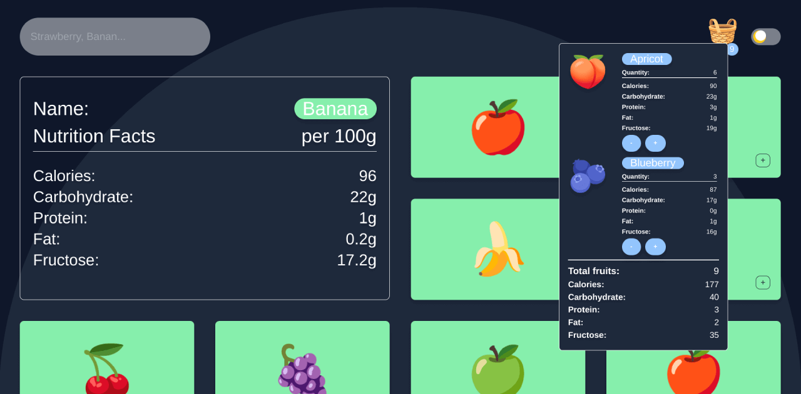

<div align="center">
    <h3>FruitApp</h3>
    <p>Built with Vue3 and TailwindCSS.</p>
    
</div>

<br>

# The Goal of FruitApp

Fruit app is a web application to track calories and nutritional data of fruits.

### Features

- Display nutritional value of various fruits.
- Tracks the nutritional value of fruits inside the basket.
- Can handle multiple quantities, e.g. 10 apples and 8 blueberries.
- Fruit search function.
- Dark mode switch.

### Technologies used

- Vue 3 and Vite
- Tailwind CSS
- Prettier & ESLint
- GitHub
- VS Code

## Getting Started

### Prerequisites

- Node.js (Version 16.14 LTS is recommended)
- npm
    ```console
    $ npm install npm@latest -g
    ```
- yarn
    ```console
    $ npm install --global yarn
    ```

### Setup

```console
$ git clone https://github.com/zamqq/vue3-fruit-app
```
After you've cloned FruitApp, you have to go into the cloned directory and run
```console
$ npm ci
$ npm run dev
```

## License

FruitApp is distributed under the `GNU General Public License v3.0`
